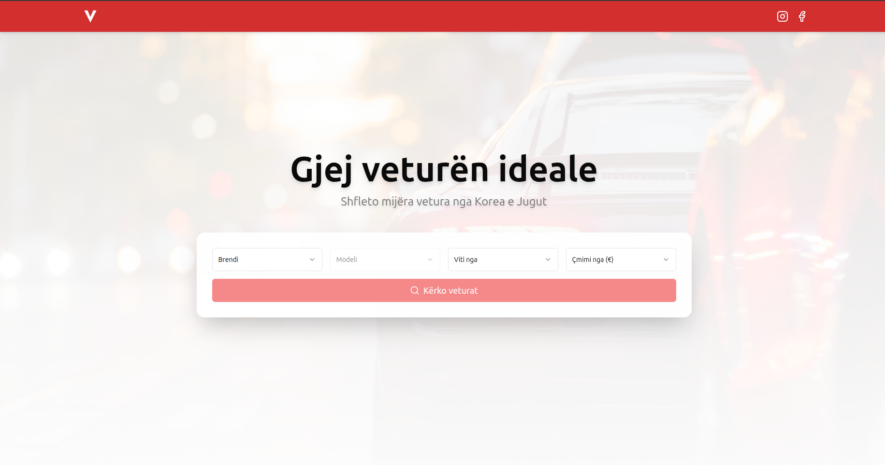
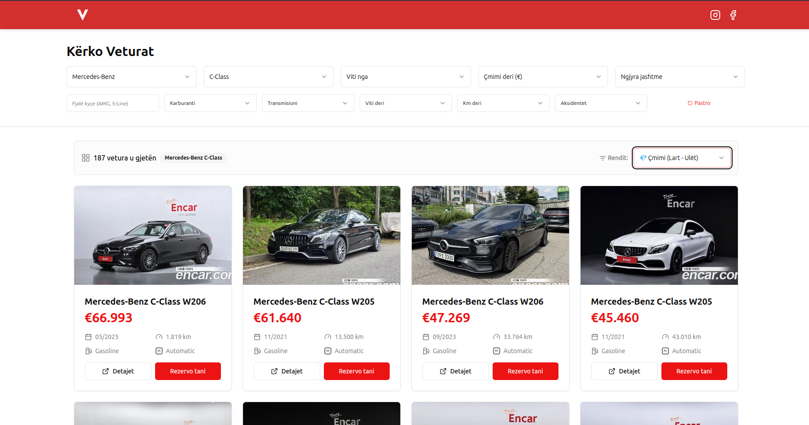
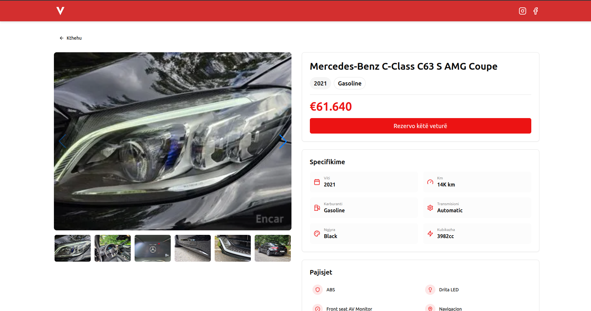

# supabase-react-vehicle-catalog
React + Vite + TypeScript + Tailwind CSS + TanStack Query + Supabase


Live demo: [https://vetrix-auto.com](https://vetrix-auto.com)

A modern web application for browsing and managing premium used car imports, targeted at the Albanian/Kosovar market. Users can view detailed car listings with photos, specs, mileage, and pricing (including delivery to Durrës port).

## Features
- Responsive car grid with search/filtering
- Detailed car pages with galleries and specs
- Data fetching with caching for smooth performance
- Authentication (if implemented)
- Admin/dashboard for managing listings (if you built that part)
- Mobile-first design with Tailwind CSS

## Tech Stack
- **Frontend**: React + Vite + TypeScript
- **Styling**: Tailwind CSS
- **Data & State**: TanStack Query (React Query)
- **Backend**: Supabase (PostgreSQL database, Authentication, Edge Functions)
- **Deployment**: Vercel (with Cloudflare DNS)

## Why I built it this way
- Switched from Create React App to Vite for blazing-fast dev server and builds 🚀
- TypeScript caught tons of bugs early — saved me hours of debugging
- TanStack Query made API calls and caching feel effortless
- Supabase handled auth, DB, and storage without needing a separate backend server
- Tailwind made responsive layouts quick and consistent across devices

| Home Page | Car Search | Car Detail |
|:---:|:---:|:---:|
|  |  |  |

## How to run locally
```bash
git clone https://github.com/fisnikdev/vetrix-auto.git
cd vetrix-auto
npm install
cp .env.example .env.local  # Add your Supabase URL/key
npm run dev

Github // Fisnikdev
